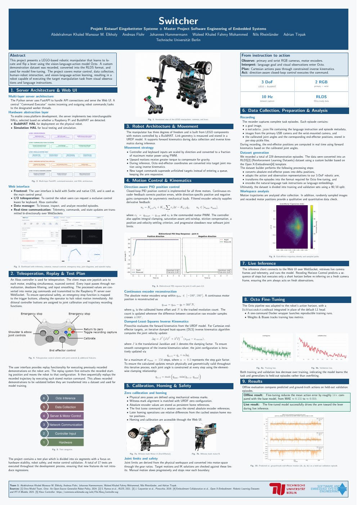

# Switcher: Fine-Tuning a Vision-Language-Action Model on a LEGO Robot Arm

A 3-DoF LEGO robot arm learns to locate and flip a lever from camera images and a language instruction, by fine-tuning the open-source vision-language-action model [Octo](https://arxiv.org/abs/2405.12213) on demonstrations recorded on the robot.

Project at TU Berlin (*Projekt Entwurf Eingebetteter Systeme* / *Master Project Software Engineering of Embedded Systems*), summer semester 2026. **My role: technical manager, model fine-tuning and evaluation, live inference on the robot.**

*Click the preview for the full poster (PDF).*

---

## Results

- **Offline:** on held-out validation episodes, fine-tuning reduces the mean action error about **14×** compared with the base Octo model (MAE ≈ 0.131 → ≈ 0.010).
- **Live:** the fine-tuned model drives the physical arm toward the lever.

---

## What I did

**Fine-tuning and evaluation**
- Adapted the Octo fine-tuning pipeline to the robot: observation window, action horizon, proprioception input
- Replaced the default L1 head with a diffusion action head and matched Octo's optimizer setup
- Weights & Biases logging with validation-set evaluation for checkpoint selection
- Compared training configurations: small vs. base model, action horizon, wrist camera vs. primary camera only
- Offline evaluation script comparing the fine-tuned checkpoint against base Octo

**Inference on the real robot**
- WebSocket inference client that pulls live camera frames and telemetry and sends Cartesian targets to the robot
- Receding horizon control: executes a few predicted steps, then re-infers on a fresh camera frame
- Ran live inference with the base, small and fine-tuned models on the physical arm

**Technical manager**
- Git setup: separate robot and backend repositories, branch-per-issue workflow with merge requests on a protected main
- GPU-enabled Docker environment for training and inference (JAX, Octo, Pinocchio)
- GitLab CI/CD with build, verify and deploy stages, Kaniko image builds, and a deploy job that checks GPU access on the real hardware

---

## System overview

| Part | Details |
|---|---|
| **Hardware** | LEGO arm with 3 degrees of freedom, Raspberry Pi with Build HAT, primary and wrist-mounted RGB cameras |
| **Robot server** | FastAPI server with a Svelte web UI, Xbox-controller teleoperation, episode recording and replay |
| **Motion control** | Direction-aware PID position control per motor, damped-least-squares inverse kinematics with Pinocchio |
| **Dataset** | 229 demonstration episodes recorded at 10 Hz, converted to the RLDS format used by Open X-Embodiment |
| **Model** | Octo with a diffusion action head, fine-tuned in JAX |

---

## Repository layout

| Folder | Contents |
|---|---|
| [`backend/`](backend) | Octo fine-tuning, offline evaluation, inference client, Docker image |
| [`robot/`](robot) | Raspberry Pi server, web UI, motor control, kinematics, data recording |
| [`organization/`](organization) | Requirements, test plan, meeting notes, milestone presentations |
| [`docs/`](docs) | Final project poster |

---

*Built in a team of six. Full credits are on the poster and in [`organization/docs/responsibilities.md`](organization/docs/responsibilities.md).*
