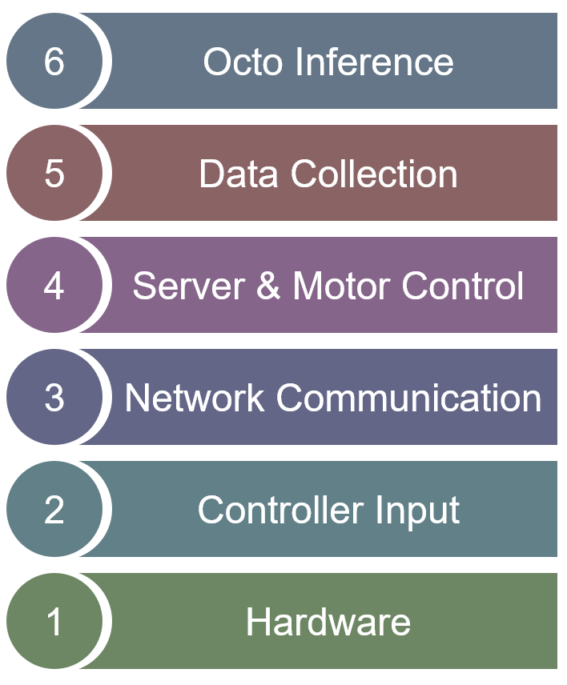

# Test Plan
## Layers
\
Hardware -> Controller Input -> Network Communication -> Server & Motor Control -> Data Collection -> Octo Inference

## Objectives
Validate:
- hardware functionality
- communication
- reliable and safe teleoperation
- motor control
- trajectory recording 
- replay behaviour (based on training data) and movement execution (based on inference)

## Systems Under Test
- Raspberry Pi Server
- LEGO BuildHAT
- Robot Arm
- Gamepad Input System
- Recording Pipeline
- Networking
- Octo Inference Pipeline

## Test Environment
- Hardware
  - Raspberry Pi 4
  - LEGO motors
  - Xbox Controller
  - Linux Workstation
  - Windows Laptops
- Software Packages
  - Python 3.10
  - For more packages with versions please see requirements.txt

### Test Phases
1. Hardware Validation
2. Teleoperation Stability
3. Networking Reliability
4. Trajectory Recording/Replay
5. Dataset Validation
6. Policy Finetuning Evaluation

## Test Responsibility
All group members of EES Team 1 are authorized to conduct these tests unless otherwise specified.

## Test Categories
### 1. Hardware Tests
#### HW-01: Motor Direction Test
Type: Manual
Phase: Hardware Validation

Objective: Verify that each motor command rotates the joint only in the corresponding direction. Ensure that changing direction abruptly is smooth.

Procedure:
1. Use GUI motor commands (via console, frontend buttons, keyboard or controller inputs) to rotate all motors in both directions. Test changing directions abruptly.

Expected Result:
Each motor rotates its joint in the expected direction. Changing direction while moving should cause no delays or unwanted movements.

Pass Criteria:
No motor rotates opposite to the expected direction. When changing direction, all motors switch without delay and do not execute any movements in the previous direction.

#### HW-02: Camera Stability Test
Type: Manual
Phase: Hardware Validation

Objective: Ensure that the wrist camera sits stably upon the end effector.

Procedure:
1. Verify visually that the wrist camera is in line with the end effector.
2. Move joint A (shoulder) from side to side and verify camera position.
3. Move joint C (end effector) up and down and verify camera position.

Expected Result:
The wrist camera does not substantially move or rotate during robot movement.

Pass Criteria:
The wrist camera's lens has not moved or rotated substantially from its initial position and is approximately in line with the end effector.

#### HW-03: Zero Calibration & Return Accuracy
Type: Manual
Phase: Hardware Validation

Objective: Verify that the robot can return to its calibrated home position.

Procedure:
1. Calibrate the robot's home position.
2. Repeat twice:
  - Move the robot away from its home position.
  - Use the 'return to zero' function.
  - Observe joint positions.

Expected Result:
The robot is able to calibrate its home position and return to it accurately.

Pass Criteria:
Both return attempts cause the robot to return to its home position without major deviations.

#### HW-04: Calibration Persistence
Type: Manual
Phase: Hardware Validation

Objective: Ensure that calibrated home position values are correctly loaded even across sessions.

Procedure:
1. Calibrate the robot's home position.
2. Move the robot away from its home position.
3. Restart the Pi server.
4. Use the 'return to zero' function.

Expected Result:
The robot is able to store its home position across server restarts and can reliably return to it.

Pass Criteria:
The robot's home position is accurate after restarting the Pi server.

### 2. Controller/Input Tests
#### C-01: Joystick Zero Test
Type: Manual
Phase: Hardware Validation

Objective: Ensure that an idle controller does not send robot commands.

Procedure:
1. Place the controller down.
2. Start the GUI and activate controller input.
3. Observe the robot without touching the controller.

Expected Result:
The robot does not move while the controller is idle.

Pass Criteria:
No movement commands are sent to the robot by an idle controller.

#### C-02: Multi-Axis Control
Type: Manual
Phase: Teleoperation Stability

Objective: Ensure that a controller can move several motors at once.

Procedure:
1. Start the GUI and activate controller input.
2. For each pair of motors (A & B, A & C, B & C), move the corresponding joints together and in opposite directions at once.
3. Observe the movement visually.

Expected Result:
The robot can be controlled multi-axially and smoothly. Each joint moves independently of the others.

Pass Criteria:
Joints can be moved simultaneously and independently of each other. Every motor executes the desired commands. There is no noticeable lag when moving them.

### 3. Networking Tests
#### N-01: Network Connection
Type: Manual
Phase: Networking Reliability

Objective: Ensure that the teleoperation client can connect to the Pi server successfully.

Procedure:
1. Start the Pi server.
2. Connect a client using the Pi's IP address.
3. Ensure that the Web GUI is responsive by sending a movement command. 

Expected Result:
The server console outputs "Client connected: {ip:port}". The robot responds to movement commands.

Pass Criteria:
A client can successfully connect to the Pi server and is responsive to commands.

#### N-02: Latency Test
Type: Manual
Phase: Networking Reliability

Objective: Ensure that robot movement commands are executed without latency.

Procedure:
1. Start the Pi server and connect a client.
2. Send a movement command.
3. Check the delay until command execution.

Expected Result:
The server is able to receive and execute commands quickly.

Pass Criteria:
The server starts executing sent commands without noticeable delay during teleoperation.

### 4. Server/Motor Control Tests
#### S-01: Command Execution
Type: Manual
Phase: Teleoperation Stability

Objective: Verify that movement commands received by the server are executed correctly.

Procedure:
1. Start the Pi server and connect a client.
2. Send movement commands for each joint individually.
3. Observe robot movement.

Expected Result:
Each command results in the correct joint movement.

Pass Criteria:
All commands are executed correctly without affecting other joints.

#### S-02: Emergency Stop
Type: Manual
Phase: Teleoperation Stability

Objective: Ensure that the emergency stop function works and stops the robot immediately.

Procedure:
1. Move multiple joints.
2. Trigger the emergency stop.
3. Observe robot behaviour.

Expected Result:
All motors stop immediately.

Pass Criteria:
Robot motion ceases within 0.5 seconds.

#### S-03: Command Rate Limiting
Type: Manual
Phase: Teleoperation Stability

Objective: Ensure the server remains responsive when receiving rapid commands.

Procedure:
1. Start the Pi server and connect a client.
2. Set PWM strength to 0.3.
3. Hold a joystick at one of its maximum values for 10 seconds.
4. Observe robot movement.

Expected Result:
Movement remains smooth without oscillations or freezing.

Pass Criteria:
There is no noticeable lag when passing and executing commands.

#### S-04: Joint Limit Enforcement
Type: Manual
Phase: Teleoperation Stability

Objective: Verify that the software joint limits cannot be exceeded.

Procedure:
1. Start the Pi server and connect a client.
2. For each motor and each of its limits:
  - Jog the joint until it reaches a limit
  - Continue jogging for a few seconds

Expected Result:
The joint stops at the configured limit.

Pass Criteria:
No joint exceeds its configured range. There is no movement when trying to push a joint past its limits.

### 5. Data Collection Tests
#### D-01: Recording Start/Stop
Type: Manual
Phase: Trajectory Recording/Replay

Objective: Verify that recordings begin and end correctly.

Procedure:
1. Start the Pi server and connect a client.
2. Start recording.
3. Move the robot.
4. Stop recording.

Expected Result:
One recording file is created and saved under the correct file path.

Pass Criteria:
The recording file exists and contains data recorded in steps.

#### D-02: Replay Consistency
Type: Manual
Phase: Trajectory Recording/Replay

Objective: Verify that episode replaying reproduces recorded trajectories.

Procedure:
1. Start the Pi server and connect a client.
2. Record a trajectory.
3. Replay the trajectory 3 times starting in different positions.

Expected Result:
The robot approximately follows the recorded trajectory.

Pass Criteria:
No significant deviation is observed in the trajectory across all test replays. End-effector follows approximately the same path.

### 6. Lever Flick Task Tests
#### L-01: Manual Task Success
Type: Manual
Phase: Dataset Validation
Objective: Measure the operator's success rate.

Procedure:
1. Perform 10 manual task executions in various positions.
2. Observe attempt successes and failures.
3. Calculate success metric using 'number of successful attempts / 10'

Expected Result:
The operator successfully completes the vast majority of task executions. 

Pass Criteria:
The manual success metric does not fall below 0.8.

#### L-02: Repeatability
Type: Manual
Phase: Dataset Validation

Objective: Determine whether repeated demonstrations are consistent.

Procedure:
1. Set a fixed lever position.
2. Perform the same trajectory 10 times.
3. Observe final joint positions and lever actuation.

Expected Result:
Manual lever flicks stay mostly consistent across attempts.

Pass Criteria:
No substantial differences are observed between repeated demonstrations.

### 7. Octo Training Tests
#### O-01: Autonomous Lever Flick
Type: Manual
Phase: Policy Finetuning Evaluation

Objective: Evaluate fine-tuned Octo performance in a final acceptance test.

Procedure:
1. Let Octo perform 20 task executions.
2. Observe task execution and determine the following metrics:
  - Success rate: 'number of successful attempts / 20'
  - Average completion time: 'sum of total successful completion time in seconds / number of successful attempts'

Expected Result:
Octo inference achieves a passable success rate and completion time.

Pass Criteria:
Octo achieves a success rate of **≥ 0.15** and an average completion time of **≤ 50 seconds**.