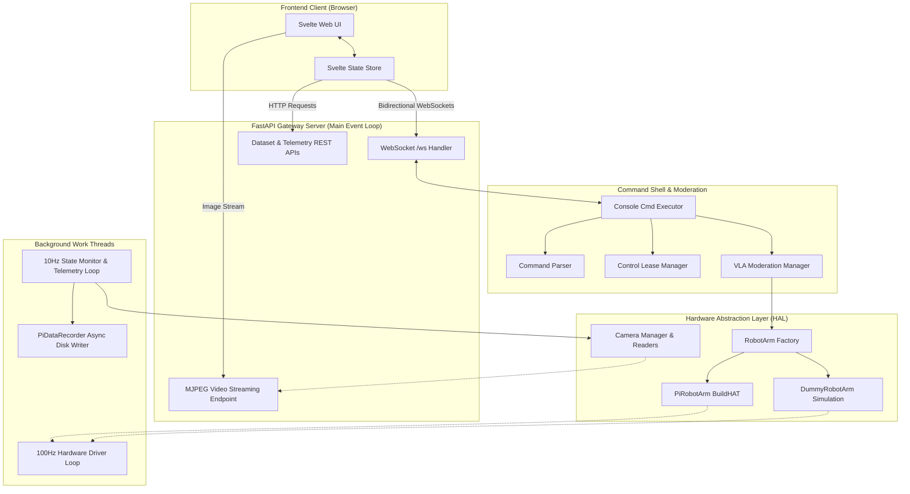
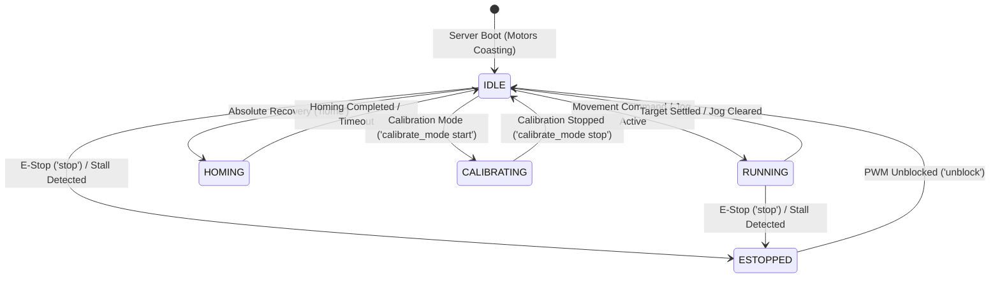

# Robot Software Architecture

Welcome to the documentation for the new robot control stack. This architecture is designed to support real-time physical joint movements, cartesian end-effector positioning, camera stream ingestion, dataset logging, and Vision-Language-Action (VLA) AI model execution.

The codebase features a web-accessible gateway enabling remote dashboard controls, joystick mapping, and program execution.

---

## Architecture Blueprint

The diagram below illustrates how components interact across threads and network boundaries:



---

## Concurrency & Threading Architecture

To maintain real-time hardware response rates while simultaneously serving high-bandwidth video streams and WebSocket telemetry, the server distributes work across multiple OS threads and asynchronous event loops:

| Thread / Loop | Host Component | Run Rate | Purpose | Thread-Safety Mechanism |
| :--- | :--- | :--- | :--- | :--- |
| **Main ASGI Event Loop** | `main.py` / FastAPI | Asynchronous | Handles HTTP requests, MJPEG frame yielding, and WebSocket send/receive pools. | `asyncio` native event loop. |
| **Hardware Driver Loop** | `BaseRobotArm._hardware_loop` | $100\text{Hz}$ ($10\text{ms}$) | Reads encoders, updates continuous positions, monitors stalls, computes proportional deceleration, and commands PWM. | `threading.Lock()` on motor operations; reads/writes shared dictionaries atomically. |
| **Monitor & Logging Loop** | `ArmController._monitor_loop` | $10\text{Hz}$ ($100\text{ms}$) | Samples arm telemetry, evaluates VLA states, triggers UI telemetry broadcasts, and generates dataset step logs. | `threading.Lock()` (`capture_lock`) when accessing recording state. |
| **Command Worker Loop** | `ConsoleCmdExecutor._worker_loop` | Event-driven (Queue) | Processes sequential queued console commands from WebSocket clients to avoid blocking the network listener. | `queue.Queue` FIFO execution. Safety commands (`stop`, `unblock`) bypass queue via direct thread spawn. |
| **Camera Reader Threads** | `CameraReader._run` | $\sim 30\text{FPS}$ ($33\text{ms}$) | Continuously pulls frames from V4L2/Picamera2 buffers and pre-encodes them to JPEG bytes. | `threading.Lock()` around `latest_frame` and `latest_frame_jpeg`. |
| **Dataset Disk Writer** | `PiDataRecorder._write_worker` | Event-driven (Queue) | Pickles step dictionaries and JPEG image arrays to SD card disk storage asynchronously. | `queue.Queue` separating RAM logging from disk I/O latency. |

---

## System Operational State Machine

The robot transitions between distinct operating states based on user commands, physical safety triggers, and homing procedures:



* **`IDLE`**: PWM drivers are unblocked, but targets are empty (`None`). Motors are in `coast()` mode.
* **`RUNNING`**: Active targets or jog velocities are being tracked by the 100Hz hardware loop.
* **`ESTOPPED`**: PWM is blocked (`pwm_blocked = True`). Movement commands are rejected until explicitly unblocked.
* **`HOMING`**: The robot is driving to its absolute zero encoder offsets. Normal movement commands are ignored.
* **`CALIBRATING`**: Software joint limits are bypassed, allowing operators to manually jog joints past boundaries to find physical zero marks.

---

## Configuration Reference (`config.json`)

The system is configured via [src/core/config.json](../src/core/config.json). Below is a detailed breakdown of all configuration parameters:

| Section | Key | Type | Default | Description |
| :--- | :--- | :--- | :--- | :--- |
| **`network`** | `host` | String | `"0.0.0.0"` | Network bind address for the FastAPI server gateway. |
| | `web_ui_port` | Integer | `9000` | HTTP and WebSocket port for web UI access. |
| **`robot`** | `gear_ratios` | Dict | `{"A": 5.0, "B": 5.0, "C": 7.0}` | Multiplication factor converting joint angle degrees to physical motor shaft degrees. |
| | `limits` | Dict | `{"A": [-45, 45], ...}` | Safe operational joint angle boundaries (in joint degrees). Enforced by driver and IK solver. |
| | `offsets` | Dict | `{"A": 75.0, ...}` | Kinematic offsets (in degrees) added to joint angles before evaluating Pinocchio forward/inverse kinematics. |
| | `default_pwm` | Dict | `{"A": {"pos": 0.22, "neg": -0.35}, ...}` | Default maximum forward (`pos`) and reverse (`neg`) PWM speed fractions ($[-1.0, 1.0]$) per axis. |
| | `absolute_offsets` | Dict | `{"A": 0.0, ...}` | Raw physical motor encoder readings corresponding to the robot's physical home zero configuration. |
| | `home_on_shutdown` | Boolean | `true` | If `true`, the arm automatically executes the homing routine before power-off on SIGINT/SIGTERM. |
| | `position_data` | Dict | `{"A_pos": 0.0, "A_revs": 0, ...}` | Persisted continuous motor positions and rotation counts saved on shutdown to detect startup jumps. |
| **`recording`** | `frequency_hz` | Integer | `10` | Sampling frequency for dataset episode step logging and telemetry broadcasts. |
| | `save_directory` | String | `"pi_recorded_data"` | Local directory name where recorded dataset episode folders are stored. |
| | `default_prompt` | String | `"flip the lever..."` | Default language instruction prompt packaged into dataset episode metadata. |
| **`control`** | `lease_duration_sec` | Float | `90.0` | Inactivity timeout in seconds before an active UI control lease expires. |
| | `auto_claim_unheld_lease`| Boolean| `true` | If `true`, incoming commands automatically claim the lease if no other client currently holds it. |

---

## Documentation Modules

To understand specific elements of the control stack, refer to the following linked documentation files:

* ### [Network Interface](network.md)
  Covers the FastAPI server structure, the bidirectional `/ws` channel, REST APIs, video streaming endpoints, and the exclusive **Control Lease** security locking system.
* ### [UI Callbacks & Thread Safety](callbacks.md)
  Explains how background OS threads safely trigger async coroutines to broadcast telemetry, logs, and VLA prompt triggers to connected web browsers.
* ### [Hardware Abstraction Layer](hardware.md)
  Details the factory pattern that dynamically loads either Lego BuildHAT drivers (`PiRobotArm`) or simulation models (`DummyRobotArm`) depending on your current system environment.
* ### [Driver Control Loop](control_loop.md)
  Analyzes the $100\text{Hz}$ driver thread, continuous encoder tracking across wrap-arounds, stall detection safety triggers, proportional deceleration curves, and deadband/hysteresis tuning.
* ### [Homing & Calibration](calibration_homing.md)
  Explains absolute homing recovery zero routines, software calibration overrides, calibration mode limit-bypass guards, and persistent configuration writing.
* ### [Movement Modalities](movement.md)
  Describes joint-space commands, continuous jogging velocities, and coordinates solving using URDF kinematic parameters and Jacobian-inverse Jacobians.
* ### [Camera Pipeline](cameras.md)
  Covers platform CSI vs UVC USB camera filtering, conflict prevention environment configurations, thread readers, stream healing, and PIL placeholder fallbacks.
* ### [Dataset Recording](recording.md)
  Details imitation-learning capture loops, async write queue threads, data structure serialization (`RobotState`, `RobotCommand`), and JSON/Pickle directory formats.

---

## Workspace Structure

The code is organized into clean functional modules:

```text
robot/
├── docs/                      # Developer architecture guides
│   ├── ARCHITECTURE.md        # Entry point architecture roadmap (This file)
│   ├── network.md             # Websockets, REST, and Leases
│   ├── callbacks.md           # Asynchronous UI thread safety
│   ├── hardware.md            # Physical and simulated motor drivers
│   ├── control_loop.md        # 100Hz driver loop, wrapping, and decel
│   ├── calibration_homing.md  # Calibration modes and offset zeroing
│   ├── movement.md            # Joint targets, jogging, and IK solvers
│   ├── cameras.md             # Camera scanning and healing pipelines
│   └── recording.md           # Telemetry pickle recording
│
├── src/
│   ├── main.py                # Server gateway entry point & lifecycles
│   │
│   ├── core/                  # Configurations and hardware profiles
│   │   ├── config.json        # Persistent settings and offsets
│   │   ├── config_loader.py   # Config loading/saving utility
│   │   └── zeroshot_prototype.xml # Kinematics URDF model description
│   │
│   ├── control/               # Server logic layers
│   │   ├── api.py             # REST routes and MJPEG streaming
│   │   ├── ws_manager.py      # Connection pool and event scheduling
│   │   └── arm_controller.py  # High-level states, VLA, and leases
│   │
│   ├── hardware/              # Motor abstractions
│   │   ├── base_arm.py        # Driver loop, kinematic solving, stalls
│   │   ├── robot_arm.py       # HAL Class Factory loader
│   │   ├── pi.py              # physical Lego BuildHAT motor implementation
│   │   ├── dummy.py           # Simulated motor and linear interpolators
│   │   └── camera_manager.py  # Multi-camera scanning & threaded readers
│   │
│   ├── commands/              # Command parsing console logic
│   │   ├── command_parser.py  # Command grammar parsing
│   │   └── console_cmd.py     # Command execution handlers
│   │
│   └── frontend/              # Svelte 5 control dashboard UI
│       └── src/lib/
│           └── store.svelte.ts # Client websocket & state engine
│
└── octolego-ees/              # External robot dependencies
    ├── shared/classes.py      # Structured recording dataclasses
    └── pi/pi_recorder.py      # Asynchronous dataset step recorder
```

---

## Server Execution Lifecycle

### 1. Initialization Phase
When `python src/main.py` is started, FastAPI mounts a lifespan async context manager:
1. Captures the main event loop context.
2. Initializes the `ArmController` which boots `RobotArm`, starts the 100Hz hardware driver loop thread, and spawns the 10Hz monitor loop.
3. Instantiates `ConsoleCmdExecutor` and registers it along with the controller in the WebSocket manager.
4. Reads `config.json` to resolve network properties (default port: `9000`) and prints local URL endpoints.

### 2. Shutdown Phase
When `SIGINT` (Ctrl+C) or `SIGTERM` is captured:
1. Closes all WebSocket client connections gracefully with code `1001` ("Server shutting down").
2. Stops camera capture reader threads.
3. Triggers controller shutdown: stops monitor loops, drains dataset logging queues, commands motors to coast, and saves the final motor positions to `config.json` to prevent position jumps on the next restart.
