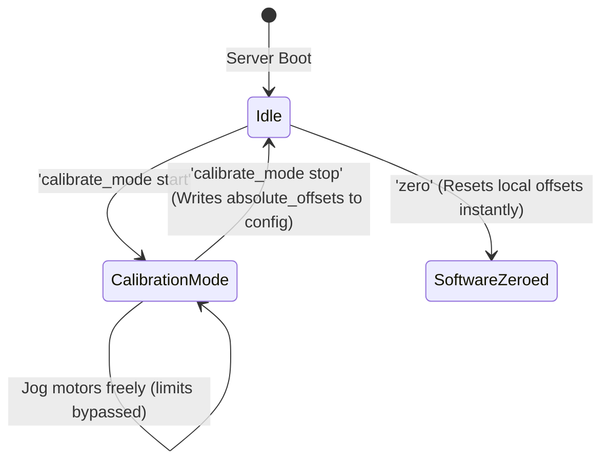

# Homing and Calibration

The robot requires precise physical alignment to ensure forward and inverse kinematics calculations align with the physical arm geometry. The system uses a dual-layer calibration model:
1. **Absolute Hardware Offsets**: Define the physical motor index configurations for homing.
2. **Kinematic Offsets**: Offsets applied to joint angles in mathematical equations to match the URDF model.

---

## Calibration Commands & Modes



---

## 1. Absolute Homing Procedure (`home`)

The `home` command executes the **Absolute Zero Recovery** sequence, driving all joints back to their physical reference positions.

```mermaid
graph TD
    Start[Command: home] --> CheckCache{Is session home cached in RAM?}
    CheckCache -->|Yes: Re-homing| RunRel[Run relative delta: session_home - current]
    CheckCache -->|No: First Boot| ReadConfig[Read absolute_offsets from config.json]
    ReadConfig --> RunAbs[Run shortest-path to absolute offset at speed=15]
    RunRel --> MonLoop[Monitor Progress Loop (Async Thread)]
    RunAbs --> MonLoop
    MonLoop --> Settled{Is error <= 2 deg?}
    Settled -->|No| StallCheck{No movement >= 0.5 deg for 1.5s?}
    StallCheck -->|Yes: Obstacle| CoastStall[Coast motor & flag stall warning]
    StallCheck -->|No| TimeoutCheck{Elapsed time > 8.0s?}
    TimeoutCheck -->|Yes: Timeout| CoastTimeout[Coast all motors & abort]
    TimeoutCheck -->|No| MonLoop
    Settled -->|Yes: All Axes Aligned| Finalize[Reset continuous counters & save config]
```

### Execution Pipeline Details
1. **Target Resolution**:
   * If `session_home_ee`, `session_home_vert`, and `session_home_base` are cached in memory (from a prior homing or calibration in the same session), the driver computes the relative distance $\Delta = \theta_{\text{session}} - \theta_{\text{current}}$ and executes `run_for_degrees(diff, speed=15, blocking=False)`.
   * Otherwise, it reads `robot.absolute_offsets` from [config.json](../src/core/config.json) and invokes `motor.run_to_position(absolute_offset, speed=15, direction="shortest", blocking=False)`.
2. **Safety Protections during Homing**:
   * **Stall Safety**: If any axis fails to shift by at least $0.5^\circ$ over a $1.5\text{s}$ window, it is assumed to have hit a physical obstruction. That motor is coassted immediately to prevent gear stripping.
   * **Hard Timeout**: The sequence enforces an **$8.0\text{-second}$ maximum duration**. If alignment is incomplete when the timer expires, all motors are coassted.

---

## 2. Startup Position Jump Detection (`check_position_jumps`)

When the server powers down gracefully, `BaseRobotArm.shutdown()` saves the final continuous positions (`A_pos`, `B_pos`, `C_pos`) and rotation counts into `config.json` under `robot.position_data`.

When the server boots back up, `_check_position_jumps()` runs a diagnostic check:
* It queries each motor for its raw physical angle: $\theta_{\text{raw}} = \text{motor.get\_aposition()}$.
* It compares this against the expected raw angle computed from the saved continuous position.
* **The $30^\circ$ Safety Threshold**: If the physical shaft position differs from the saved shutdown position by **$> 30.0^\circ$** on any axis, the driver logs a prominent warning:
  `[WARNING] Axis A position jumped by 45.2° while powered off! Someone moved the arm manually.`
* **Operational Impact**: This alerts remote operators that the arm was manually manipulated or knocked out of alignment while offline, indicating that an immediate `home` or `calibrate_mode` procedure should be run before executing precision trajectories.

---

## 3. Offset Comparison Reference Table

The system uses three distinct offset parameters across the control and mathematical layers:

| Offset Type | Storage Location | Config Key | When Modified | Purpose & Behavior |
| :--- | :--- | :--- | :--- | :--- |
| **Absolute Hardware Offsets** | `config.json` | `robot.absolute_offsets` | Modified via `calibrate_mode stop` | Stores the exact raw Lego encoder angle $[-180^\circ, 180^\circ]$ corresponding to the physical home position. Used by `home`. |
| **Kinematic Model Offsets** | `config.json` | `robot.offsets` | Modified via `calibrate <joint> <val>` | Mathematical constant added to joint angles before passing them to the Pinocchio forward/inverse kinematics solver ($q = \theta_{\text{joint}} + \theta_{\text{offset}}$). |
| **Session Zero Offsets** | In-Memory RAM | `pos_dict[A_offset]` | Modified via `zero` or `home` | Transient software zero reference. The `zero` command sets this to the current raw angle instantly, resetting continuous degrees without touching disk storage. |

---

## 4. Calibration Mode (`calibrate_mode`)

When setting up or recovering a robot arm, operators manually align the joints using the UI or game controllers.

* **`calibrate_mode start`**:
  * Sets `is_calibrating = True`.
  * Unblocks PWM safety blocks.
  * **Bypasses Software Limits**: Allows joints to be jogged freely past limits to find physical endpoints.
* **`calibrate_mode stop`**:
  * Sets `is_calibrating = False`.
  * Queries each motor for its current absolute position (`get_aposition()`).
  * Saves these angles into the `absolute_offsets` key in [config.json](../src/core/config.json).
  * Re-initializes the position tracking states (`pos_dict` offsets, continuous positions, and revolutions).
  * Caches these values as the new session home references on disk.

---

## 5. Software Zeroing (`zero`)

Unlike `calibrate_mode stop`, which saves physical hardware offsets, the `zero` command applies a quick software offset calibration:
* Sets `pos_dict` offsets to the current raw absolute motor positions.
* Resets in-memory continuous positions (`A_pos`, `B_pos`, `C_pos`) and revolutions to `0`.
* **Behavior**: Instantly declares the current physical pose as the "zero degrees" software pose for the duration of the current run, without modifying the persistent homing reference offsets.
