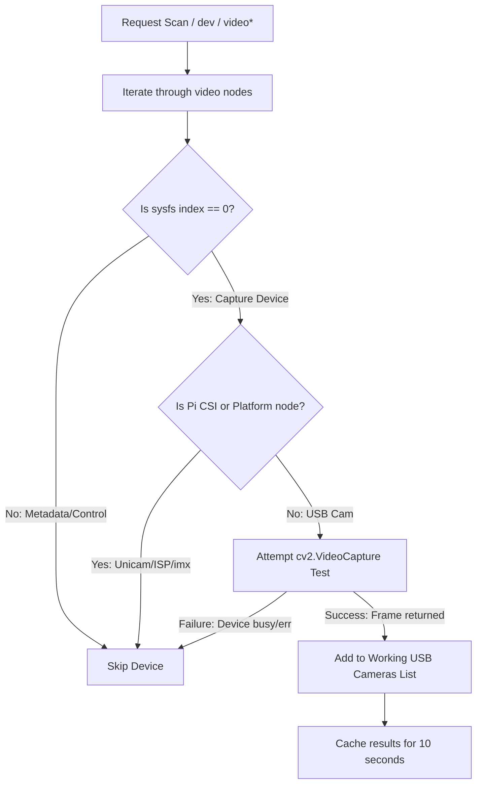

# Camera Management and Discovery

The robot features a multi-camera vision system supporting two viewports: a Top View Camera (typically a USB Webcam) and a Wrist Camera (typically a Raspberry Pi CSI camera). The camera subsystem manages hardware discovery, avoids resource conflicts, and handles stream recovery automatically.

---

## Camera Discovery Flow



---

## 1. Camera Detection & V4L2 Sysfs Filtering

Discovery occurs in [camera_manager.py](../src/hardware/camera_manager.py) using two filtering steps to ensure only valid UVC (USB) cameras are passed to OpenCV:

### 1. Metadata Node Filtering
Linux Video4Linux2 (V4L2) registers multiple `/dev/video*` devices for a single physical camera—typically one node for raw frame capture and several supplementary nodes for hardware metadata, ISP parameters, or control interfaces. 

To identify the true capture node, the scanner reads the sysfs index:
* **Example Sysfs Structure**:
  ```text
  /sys/class/video4linux/video0/index -> "0"  (Capture Node -> VALID)
  /sys/class/video4linux/video1/index -> "1"  (Metadata Node -> IGNORE)
  ```
* Any node where `/sys/class/video4linux/video[X]/index` does not equal `"0"` is discarded immediately without opening an OpenCV capture handle.

### 2. Platform CSI Filtering
To prevent OpenCV from grabbing the Raspberry Pi CSI camera (which must be exclusively controlled by `Picamera2`), the scanner inspects driver names and device paths:
* Reads `/sys/class/video4linux/video[X]/name` for reserved SoC keywords: `unicam`, `bcm2835`, `isp`, `codec`, `imx`, `ov56`, `ov88`, `hevc`.
* Resolves the symlink `/sys/class/video4linux/video[X]/device` and checks if it points to an internal `platform` or `soc` device tree node rather than a USB bus.
* If platform tags are detected, the node is excluded from USB webcam pools.

---

## 2. Libcamera Conflict Mitigation Deep Dive

A notorious failure mode on Linux kernel 6.x / Raspberry Pi OS Bookworm is resource conflict between libcamera and UVC (USB Video Class) webcams. 

By default, libcamera scans all `/dev/video*` devices on boot and attempts to claim UVC webcams using its generic V4L2 pipeline handler. When `cv2.VideoCapture` subsequently attempts to open that same webcam in Python, the kernel throws `Device or resource busy (EBUSY)` and crashes the vision stack.

To eliminate this race condition, `camera_manager.py` injects a strict pipeline match constraint into the OS environment *before* any video libraries are initialized:

```python
# Force libcamera to ONLY bind to native Raspberry Pi CSI pipeline handlers (vc4/unicam).
# It will completely ignore USB webcams, leaving them 100% free for OpenCV.
os.environ["LIBCAMERA_PIPELINES_MATCH_LIST"] = "rpi/vc4,rpi/unicam,raspberrypi"
```

---

## 3. Slot Mapping Layout

The cameras are mapped to slots to establish predictable streaming ports:

* **Slot 0: Top View Camera**
  * **Default Target**: USB Webcam.
  * **Discovery**: Assigned to the first working USB webcam detected by `get_working_cameras()`.
  * **Fallback**: `/dev/video0`.
* **Slot 1: Wrist Camera**
  * **Default Target**: Raspberry Pi CSI Camera.
  * **Discovery**: If `picamera2` is installable, the slot is assigned as type `picamera2`.
  * **Desktop / Simulation Fallback**: If running on a PC, it maps to the second working USB webcam (if present) or `/dev/video1`.

---

## 4. Threaded Readers & Pre-Encoding Architecture

To keep HTTP video streaming non-blocking and ensure high frame rates, each active slot instantiates a background `CameraReader` thread:

```python
class CameraReader:
    def _run(self):
        while self.running:
            success, frame = self.cap.read()
            if success:
                # Pre-encode JPEG in background thread
                _, jpeg_bytes = cv2.imencode('.jpg', frame, [cv2.IMWRITE_JPEG_QUALITY, 75])
                with self.lock:
                    self.latest_frame = frame
                    self.latest_frame_jpeg = jpeg_bytes.tobytes()
```

### CPU Optimization: Why Background Pre-Encoding?
If frame encoding (`cv2.imencode`) were executed inside the async HTTP endpoint `/video_feed`, the server would have to compress the same 640x480 frame independently for *every* connected client browser, causing severe CPU spikes on the Raspberry Pi.

By encoding the frame **once per camera capture iteration** inside the background reader thread and caching the resulting binary payload in `self.latest_frame_jpeg`, the `/video_feed` endpoint simply streams pre-compressed memory buffers, supporting multiple concurrent web UI viewers with zero extra encoding overhead.

### Auto-Healing Mechanism
USB connections are prone to electrical noise and intermittent disconnects. The `CameraReader` monitors frame retrieval timestamps:
* If frame retrieval fails for over **1.0 second**, a freeze is declared.
* **Recovery Sequence**: The thread releases the `cv2.VideoCapture` handle, flushes internal frame caches, pauses for $2.0\text{s}$, initiates a bus rescan, and attempts a clean hardware re-binding.

---

## 5. Offline Placeholders

If a camera is offline or disconnected, `camera_manager` avoids breaking the HTTP stream or UI layouts. Instead, it generates a clean placeholder JPEG dynamically in memory using PIL:

```python
def generate_placeholder_frame(slot_idx: int) -> bytes:
    # Generates a dark placeholder image with slot identification
    # and a "FEED OFFLINE / CAMERA NOT CONNECTED" warning label.
```

This frame is returned instantly as fallback bytes whenever `get_frame_jpeg()` returns `None`.
