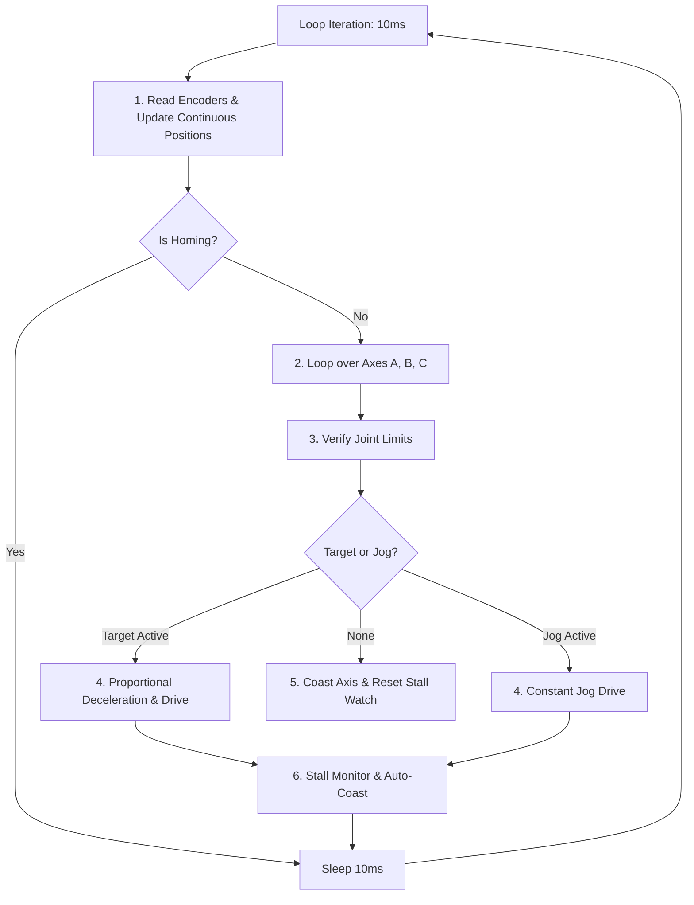

# Driver Control Loop & Position Tracking

The core execution engine of the robot driver is a high-speed background loop running inside [base_arm.py](../src/hardware/base_arm.py). It manages encoder wrapping, executes trajectory profiling, monitors for physical stalls, and commands the motor drivers.

---

## The Driver Loop (`_hardware_loop`)

Upon instantiation, the robot arm spawns a dedicated daemon thread that runs at approximately **100Hz** (10ms sleep intervals). 



---

## Continuous Position Tracking

Lego absolute encoders only report raw positions in the range $[-180^\circ, 180^\circ]$. If a motor rotates past $180^\circ$ (e.g. into $181^\circ$), the encoder wraps around to $-179^\circ$. Without handling, this wrap-around breaks control loops.

### 1. Wraparound Tracking Algorithm
To construct a continuous, unbounded coordinate space, the driver monitors raw encoder deltas:

1. **Calculate the raw change** since the last loop iteration:
   $$\Delta_{\text{raw}} = \theta_{\text{current\_raw}} - \theta_{\text{prev\_raw}}$$
2. **Detect wrap-arounds**:
   * If $\Delta_{\text{raw}} < -180^\circ$, the motor crossed the wrapping boundary forward (e.g., from $+180^\circ$ to $-179^\circ$). The rotation counter is incremented:
     $$\text{Revs} = \text{Revs} + 1$$
   * If $\Delta_{\text{raw}} > 180^\circ$, the motor crossed the wrapping boundary backward (e.g., from $-180^\circ$ to $+179^\circ$). The rotation counter is decremented:
     $$\text{Revs} = \text{Revs} - 1$$
3. **Calculate the continuous position**:
   $$\theta_{\text{continuous}} = \theta_{\text{current\_raw}} - \theta_{\text{offset}} + (\text{Revs} \cdot 360^\circ)$$

### 2. Numerical Walk-Through Example
Assume a motor starts at $+175^\circ$ with offset $0^\circ$ and $\text{Revs} = 0$. The arm rotates forward by $10^\circ$:
* **Step 1 (At $+175^\circ$)**: $\theta_{\text{prev\_raw}} = 175^\circ$, $\text{Revs} = 0$, $\theta_{\text{continuous}} = 175^\circ$.
* **Step 2 (After rotating $10^\circ$)**: The physical encoder crosses $+180^\circ$ and reports $\theta_{\text{current\_raw}} = -175^\circ$.
* **Delta Calculation**: $\Delta_{\text{raw}} = -175^\circ - 175^\circ = -350^\circ$.
* **Boundary Evaluation**: Because $-350^\circ < -180^\circ$, the forward wrap condition triggers $\rightarrow \text{Revs}$ increments to $1$.
* **Continuous Position**: $\theta_{\text{continuous}} = -175^\circ - 0^\circ + (1 \cdot 360^\circ) = +185^\circ$. The control loop experiences a smooth, continuous angle trajectory without a discontinuous jump.

---

## Proportional Deceleration Trajectory

To eliminate mechanical wobble, wobble-induced gear wear, and overshoot, the driver uses a proportional deceleration ramp instead of bang-bang control:

* **`DECEL_THRESHOLD_DEG = 15.0`**: Distance from target (in motor degrees) where deceleration begins.
* **`MIN_PWM = 0.08`**: Minimum power output to prevent the motor from stall-stopping before reaching the target.
* **`TOLERANCE_DEG = 2.0`**: Target deadband.

### 1. Ramping Formula
When the absolute error $E_{\text{err}} = |\theta_{\text{target}} - \theta_{\text{current}}|$ is within the deceleration zone ($E_{\text{err}} < 15^\circ$):

$$\text{Factor} = \frac{E_{\text{err}} - \text{TOLERANCE}}{\text{DECEL\_THRESHOLD} - \text{TOLERANCE}}$$

$$\text{Effective PWM} = \text{MIN\_PWM} + \text{Factor} \cdot (\text{Max\_PWM} - \text{MIN\_PWM})$$

If $E_{\text{err}} \ge 15^\circ$, the motor runs at full commanded speed ($\text{Max\_PWM}$).

### 2. Numerical PWM Output Reference
For a motor configured with $\text{Max\_PWM} = 0.35$ and $\text{MIN\_PWM} = 0.08$:

| Angular Error ($E_{\text{err}}$) | Zone Status | Calculated Factor | Commanded PWM Speed | Mechanical Action |
| :--- | :--- | :--- | :--- | :--- |
| **$\ge 15.0^\circ$** | Full Speed | $1.00$ (Maxed) | **$0.350$** ($100\%$ Max) | High-speed approach toward target |
| **$11.75^\circ$** | Deceleration Ramp | $0.75$ | **$0.282$** ($80\%$ Max) | Smooth braking initiated |
| **$8.50^\circ$** | Deceleration Ramp | $0.50$ | **$0.215$** ($61\%$ Max) | Progressive linear slowdown |
| **$5.25^\circ$** | Deceleration Ramp | $0.25$ | **$0.147$** ($42\%$ Max) | Final gentle glide into target |
| **$2.50^\circ$** | Deceleration Ramp | $0.04$ | **$0.090$** ($26\%$ Max) | Creeping velocity to avoid overshoot |
| **$\le 2.00^\circ$** | Deadband Settled | $0.00$ | **$0.000$** (`coast()`) | Target reached; power coils disabled |

---

## Serial UART Bus Saturation Mitigation

The BuildHAT serial protocol over `/dev/serial0` operates at 115200 baud. If the $100\text{Hz}$ hardware loop transmits new PWM commands to ports A, B, and C every 10 milliseconds regardless of speed changes, the UART queue can become congested, causing command latency and serial timeout exceptions.

To optimize UART bandwidth, `BaseRobotArm` maintains an output cache (`self.last_sent_pwm[axis]`):
```python
# Only transmit over UART if speed changed by > 2% or motor direction flipped
if abs(effective_pwm - self.last_sent_pwm[axis]) > 0.02 or effective_pwm == 0.0:
    motor.pwm(effective_pwm)
    self.last_sent_pwm[axis] = effective_pwm
```
This reduces serial traffic by over $85\%$ during steady-state motion while preserving instant responsiveness when target speeds change.

---

## Deadband & Hysteresis

To avoid "hunting" (chattering back and forth around the target position), the driver uses deadbands and hysteresis:
* **Deadband Tolerance (`TOLERANCE_DEG = 2.0`)**: If the motor reaches within $2^\circ$ of the target, the driver commands it to `coast()` and clears the target.
* **Hysteresis Band (`HYSTERESIS_DEG = 1.0`)**: Once settled, the target controller is locked. The driver will not reactivate the motor unless the position drifts or is commanded to a position that exceeds the deadband plus hysteresis:
  $$E_{\text{err}} > \text{TOLERANCE} + \text{HYSTERESIS} \quad (3.0^\circ)$$

---

## Stall Detection

To protect Lego plastic gears and prevent motor burnouts if the arm hits an obstacle, the driver monitors motion progress:

* **Stall Timeout (`STALL_TIMEOUT_SECONDS = 1.5`)**
* **Min Progress (`STALL_MIN_PROGRESS_DEG = 1.0`)**

### Verification Logic
If a command (Target or Jog) is actively driving a motor:
1. The driver checks if the motor position has shifted by at least $1^\circ$ since the last progress timestamp.
2. If it moved, the progress timestamp resets to the current time.
3. If the motor fails to make $1^\circ$ of progress for over $1.5$ seconds, a stall is declared.
4. **Action**: The motor is put into `coast()` mode immediately, its targets and jogs are cleared, and a warning is logged to the system.
