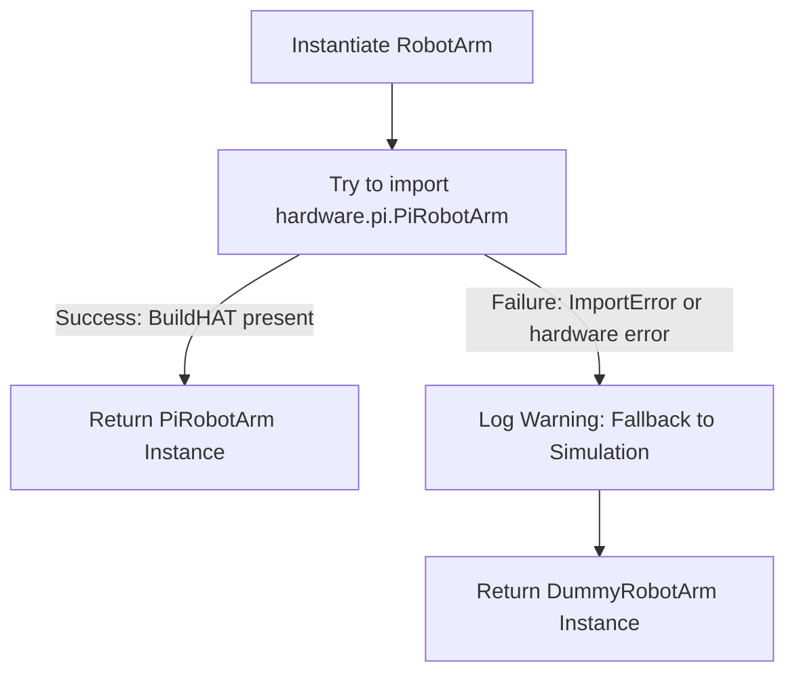

# Hardware Abstraction Layer

The robot codebase uses a unified hardware interface to allow developers to run, test, and calibrate the robot control logic both on physical hardware (Raspberry Pi with BuildHAT) and local development setups (desktop simulator/dummy mode).

---

## The Hardware Factory Pattern

The core interface is defined by the `RobotArm` class in [robot_arm.py](../src/hardware/robot_arm.py). Instead of direct instantiation, `RobotArm` implements a factory pattern in its `__new__` method:



This dynamic fallback guarantees that the server starts regardless of whether it is running on a physical Raspberry Pi or a developer's notebook.

---

## Abstract Base Class: `BaseRobotArm`

Located in [base_arm.py](../src/hardware/base_arm.py), `BaseRobotArm` implements all core logic that is independent of physical hardware:
* Loading configuration settings (`limits`, `gear_ratios`, `offsets`, `default_pwm`).
* Thread management for the high-speed driver loop (`_hardware_loop`).
* Kinematics calculation using Pinocchio.
* Continuous position tracking, stall detection, and deceleration ramps.

Subclasses are only required to implement `_init_motors(...)` to bind the three active motor objects:
* **`motor_ee`**: End-Effector actuator (Port A).
* **`motor_vert`**: Vertical arm segment actuator (Port B).
* **`motor_base`**: Base rotation actuator (Port C).

---

## Physical BuildHAT: `PiRobotArm`

Located in [pi.py](../src/hardware/pi.py), `PiRobotArm` initializes connection to the official Lego BuildHAT:

```python
from buildhat import Motor
from hardware.robot_arm import RobotArm

class PiRobotArm(RobotArm):
    def _init_motors(self, motor_ee_port: str, motor_vert_port: str, motor_base_port: str):
        self.motor_ee = Motor(motor_ee_port)
        self.motor_vert = Motor(motor_vert_port)
        self.motor_base = Motor(motor_base_port)
        self.motors = {"A": self.motor_ee, "B": self.motor_vert, "C": self.motor_base}
```

### 1. Hardware Pin & Port Mapping
The Raspberry Pi communicates with the BuildHAT over the GPIO UART serial bus (`/dev/serial0` at 115200 baud). The motors map directly to the HAT's labeled ports:

| Port Label | Axis Name | Motor Function | Gear Ratio | Direction |
| :--- | :--- | :--- | :--- | :--- |
| **Port A** | `motor_ee` | End-Effector Tool / Gripper orientation | $5.0 : 1$ | Forward / Inverse |
| **Port B** | `motor_vert`| Vertical Elbow & Wrist Elevation | $5.0 : 1$ | Forward / Inverse |
| **Port C** | `motor_base`| Turntable Base Rotation Axis | $7.0 : 1$ | Forward / Inverse |

### 2. BuildHAT Motor Methods & Serial Limitations
The Lego BuildHAT python wrapper controls the embedded RP2040 microcontroller on the HAT:
* **`get_aposition()`**: Retrieves the absolute raw encoder position in the range $[-180^\circ, 180^\circ]$.
* **`pwm(speed_fraction)`**: Commands the motor coils at speed fraction $[-1.0, 1.0]$.
* **`coast()`**: Disables H-bridge drivers, allowing the arm to move freely.
* **UART Bus Saturation Warning**: Sending serial commands faster than $100\text{Hz}$ across three ports simultaneously can cause serial buffer overflows. The driver mitigates this by caching `last_sent_pwm` per motor and omitting serial transmission if $\Delta_{\text{speed}} < 0.02$.

---

## Simulation: `DummyRobotArm` & Linear Motion Interpolation

Located in [dummy.py](../src/hardware/dummy.py), `DummyRobotArm` binds three `DummyMotor` objects. Because physical Lego motors have distinct mechanical inertias and encoder wrap-arounds, `DummyMotor` emulates these behaviors using mathematical integration threads.

### 1. Continuous Angle Integration & Wrapping
Every call to retrieve motor position (`get_position()` or `get_aposition()`) calculates the elapsed time $\Delta t$ since the last read and integrates velocity:

$$\theta_{\text{continuous}} = \theta_{\text{old}} + \left(\omega_{\text{target}} \cdot \Delta t\right)$$

To emulate physical BuildHAT absolute encoders, `get_aposition()` projects the continuous position into the $[-180^\circ, 180^\circ]$ domain using modulo arithmetic:

$$\theta_{\text{abs}} = \left(\left(\theta_{\text{continuous}} + 180\right) \bmod 360\right) - 180$$

### 2. Trajectory Simulation (`_run_motion` Thread)
When homing or running calibration recovery, the driver invokes `run_to_position(target, speed, blocking=False)` or `run_for_degrees(delta, speed)`. In simulation, this spawns a background thread that linear-interpolates the transition:

```python
def _run_motion(self, start_pos, target_pos, duration):
    start_time = time.time()
    while time.time() - start_time < duration:
        elapsed = time.time() - start_time
        fraction = min(1.0, elapsed / duration)
        # Linear interpolation
        self.simulated_pos = start_pos + (target_pos - start_pos) * fraction
        time.sleep(0.01) # Sleep 10ms to match 100Hz hardware loop rate
    self.simulated_pos = target_pos
    self.is_running = False
```

* **Speed Scaling Calculation**: Duration is computed from speed as $\text{Duration} = \frac{|\Delta \theta|}{\text{speed} \times 500.0 / 100.0}$.
* **Thread Safety**: The thread updates `self.simulated_pos` atomically, allowing the main 100Hz loop in `base_arm.py` to sample simulated encoder progress without thread locking contentions.
