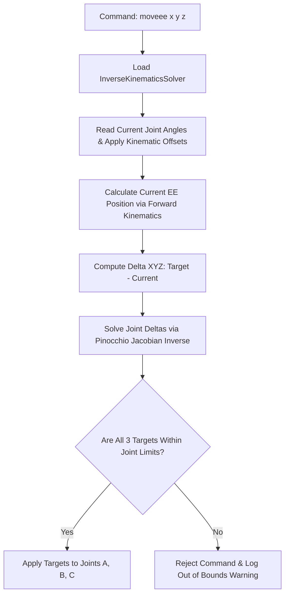

# Movement Control Systems

The robot arm supports three distinct movement modalities: joint-space target tracking, continuous velocity jogging, and Cartesian coordinate end-effector positioning solved via Inverse Kinematics (IK).

---

## Complete Movement Command Reference Table

The console command engine parses text strings into structured movement targets:

| Command Syntax | Arguments | Example | Description | Safety & Limit Guards |
| :--- | :--- | :--- | :--- | :--- |
| **`move`** | `<joint> <angle> [speed]` | `move A 15.0 0.3` | Drives `<joint>` (`A`, `B`, or `C`) to absolute `<angle>` degrees. Optional `<speed>` scales maximum PWM. | Validates `<angle>` against `robot.limits` in `config.json`. Bypasses limit check if `is_calibrating = True`. |
| **`jog`** | `<joint> <dir> [scale]` | `jog B -1.0 0.8` | Sets velocity jogging direction `[-1.0, 1.0]` for `<joint>`. A value of `0.0` halts the jog. Optional `<scale>` modulates speed fraction. | Continually checks joint limits at $100\text{Hz}$ during motion. If boundary exceeded, jog is canceled and motor coasts. |
| **`moveee`**| `<x> <y> <z> [pwm_scale]` | `moveee 0.12 0.0 0.25 0.5` | Computes IK to move the gripper tool tip to Cartesian coordinates $(x, y, z)$ in meters. Optional `<pwm_scale>` caps joint speed. | Validates that **all** solved joint target angles conform to limits before commanding any motor. Rejects entire move if one joint out of bounds. |

---

## 1. Joint-Space Movement (`move`)

Joint-space movement commands drive a specific axis directly to a target angle.
* **Console Command**: `move <joint> <angle_deg> [speed_fraction]` (e.g. `move A 15.0 0.3`).
* **Execution Flow**:
  1. Checks if PWM is blocked (e-stop) or if the arm is homing.
  2. Bypasses limits if calibrating; otherwise, validates that the target joint angle is within `robot.limits` (e.g., Joint A within $[-45^\circ, 45^\circ]$).
  3. Translates the target joint angle to physical motor degrees by multiplying by the gear ratio:
     $$\theta_{\text{motor\_target}} = \theta_{\text{joint\_target}} \cdot \text{GearRatio}_{\text{axis}}$$
  4. Stores the target motor degrees in `self.targets[axis]`.
  5. The high-speed hardware loop takes over, applying proportional deceleration profiling until the motor settles within the deadband tolerance.

---

## 2. Continuous Jogging (`jog`)

Jogging is a velocity-based control mode primarily used for real-time manual tracking via keyboard buttons, gamepad joysticks, or UI sliders.
* **Console Command**: `jog <joint> <direction> [scale]` (e.g. `jog B -1.0 0.8`).
* **Execution Flow**:
  1. Direction must be in the range $[-1.0, 1.0]$. A value of `0.0` halts the jog.
  2. Clears any active joint-space targets for that axis (`targets[axis] = None`).
  3. Sets `self.jogs[axis] = direction` and scales the output by `jog_scales[axis] = scale`.
  4. In the hardware loop, the motor is driven continuously using:
     $$\text{PWM} = \text{Direction} \cdot \text{MaxPWM}_{\text{axis}} \cdot \text{Scale}$$
  5. **Safety Bounds**: The driver loop continuously checks position limits. If the motor exceeds its limits while jogging, the jog command is cleared instantly, and the motor is put into `coast()` mode.

---

## 3. End-Effector Cartesian Control (`moveee`)

The end-effector coordinate system allows developers to drive the tool center point to a specific $(x, y, z)$ position in meters relative to the robot's base coordinate frame.

### 1. Mathematical Kinematics Pipeline
1. **URDF Loading & Kinematic Tree Mapping**:
   * The system builds a kinematic tree using Pinocchio from the URDF XML config file: [zeroshot_prototype.xml](../src/core/zeroshot_prototype.xml).
   * **Array Ordering**: In the URDF tree, the kinematic root begins at the base turntable and terminates at the gripper tool tip. Consequently, the Pinocchio joint vector $q$ reverses the alphabetical motor dictionary ordering:
     $$q = \begin{bmatrix} q_0 \\ q_1 \\ q_2 \end{bmatrix} \equiv \begin{bmatrix} \text{Axis C (Base Turntable)} \\ \text{Axis B (Vertical Elbow)} \\ \text{Axis A (End-Effector Wrist)} \end{bmatrix}$$
2. **Current Joint State Configuration**:
   * Retrieves current joint angles, converts them to radians, and applies the kinematic offsets:
     $$q_{\text{current}} = [\theta_C + \text{Offset}_C, \; \theta_B + \text{Offset}_B, \; \theta_A + \text{Offset}_A]$$
3. **Inverse Kinematics Solver**:
   * Instantiates the custom C++ wrapped `InverseKinematicsSolver` from the `octolego-ees` workspace.
   * Computes the Cartesian displacement vector:
     $$\Delta X = X_{\text{target}} - X_{\text{current}}$$
   * Computes joint deltas using the pseudo-inverse Jacobian method:
     $$\Delta q = J^\dagger(q) \cdot \Delta X$$

### 2. Singularity & All-or-Nothing Limit Verification
In Jacobian-based IK solvers, requesting targets near kinematic singularities (such as extending the arm completely straight or folding it completely flat) can generate extremely large angular deltas ($\Delta q$) that would drive joints past their physical mechanical limits.

To protect the arm from partial execution:
* `apply_joint_delta_command()` evaluates the resulting target angles for all three axes simultaneously:
  $$\theta_{\text{target\_i}} = \theta_{\text{current\_i}} + \Delta q_i$$
* If **even a single axis** exceeds its configured boundary in `robot.limits`, the entire command is rejected, and **zero** motors are actuated.
* **User Warning**: The server emits a terminal log: `[WARNING] IK Target out of bounds for Joint B: -55.2° not in [-50.0°, 20.0°]`.
