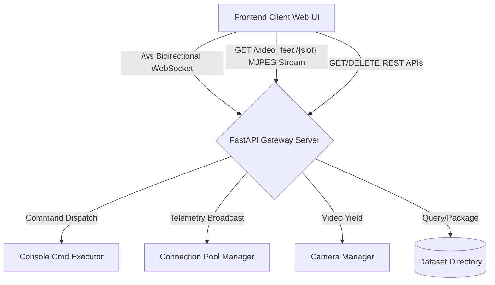
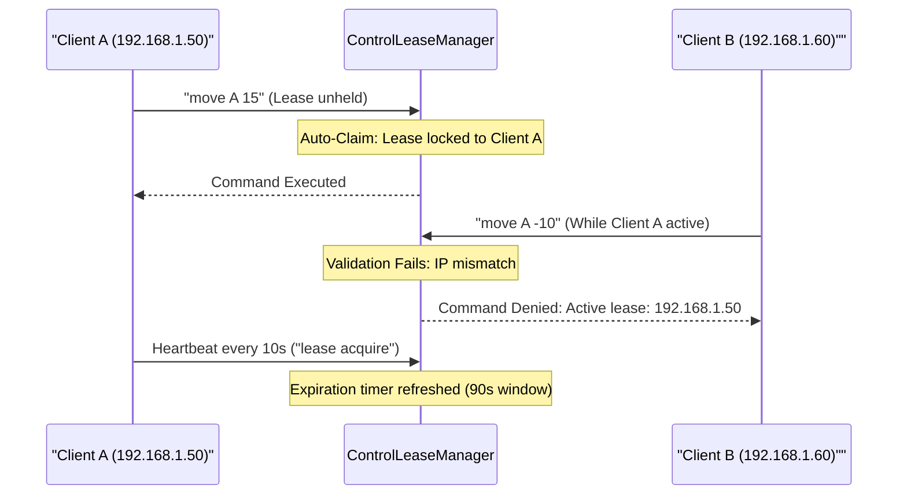

# Network Architecture

The robot server is powered by a FastAPI application, offering a dual-mode communication stack:
1. **HTTP (REST) APIs** for static configurations, file transfers, and recorded dataset management.
2. **WebSocket Connection (`/ws`)** for low-latency bidirectional control, real-time logging, and telemetry streaming.

---

## Network Architecture Overview



---

## WebSocket Interface (`/ws`)

A single, persistent WebSocket endpoint handles all real-time events. 

### Connection Management
Clients are tracked inside the `ConnectionManager` class in [ws_manager.py](../src/control/ws_manager.py):
* On connection, the client is added to a global set `connected_clients`.
* A connection status packet is immediately broadcast to all clients indicating the updated client count.
* Historical server logs (up to the last 50) are pushed to the newly connected client to populate their terminal buffer.

### Complete WebSocket Payload Reference Table

#### Downstream Messages (Server -> Client)
All server events are serialized as JSON strings containing a `"type"` identifier:

| Payload Type | Frequency / Trigger | Schema Fields | Purpose |
| :--- | :--- | :--- | :--- |
| **`telemetry`** | $10\text{Hz}$ Continuous | `angles`, `speeds`, `ee_position`, `limits`, `offsets`, `is_homed`, `pwm_blocked`, `is_homing`, `is_calibrating`, `is_capturing`, `capture_count`, `client_count`, `lease_holder`, `vla_mode`, `has_pending_vla` | Synchronizes the frontend Svelte store with real-time hardware state, active limits, and UI permissions. |
| **`chat_response`** | On system log or command output | `text` (String), `sender` (`"system"` or `"user"`), `command` (Optional string) | Renders terminal logs, command execution responses, and error warnings on the dashboard console. |
| **`vla_pending`** | On moderated VLA action request | `action` (Dict containing `agent_id`, `target_positions`, `target_velocities`, `timestamp`) | Triggers an interactive approval/rejection modal on the web dashboard when an AI agent attempts to move the arm. |
| **`vla_resolved`** | On moderation action | `status` (`"approved"` or `"rejected"`) | Informs the UI that the pending VLA step has been processed. |
| **`vla_inference_trigger`**| On manual trigger / cron | None (Empty payload `{}`) | Instructs connected VLA client scripts to grab current camera frames and compute their next action step. |

#### Upstream Messages (Client -> Server)
Clients can send either plain-text command strings or structured JSON objects:

| Payload Type | Sender | Schema Fields | Server Behavior |
| :--- | :--- | :--- | :--- |
| **`console`** | Svelte UI / Terminal | `type: "console"`, `value: "<command_string>"`, `silent: boolean` | Passes `<command_string>` to `CommandParser`. If `silent` is true, the command output is not echoed to the global UI chat feed. |
| **`vla_register`** | AI Agent Script | `type: "vla_register"`, `agent_id: "id"`, `name: "name"`, `options: {}` | Registers an external VLA script in `VLAModerationManager` and notifies the dashboard. |
| **`vla_action`** | AI Agent Script | `type: "vla_action"`, `agent_id: "id"`, `target_positions: [[A, B, C]]`, `target_velocities: [vA, vB, vC]` | Routes movement proposal to `VLAModerationManager`. In `moderated` mode, queues for human review; in `auto` mode, executes immediately. |

---

## Control Lease Security & Heartbeat Mechanics

To prevent command collisions when multiple operators open the web dashboard or connect scripts simultaneously, the server implements an IP-bound **Control Lease** locking system in [arm_controller.py](../src/control/arm_controller.py).



### 1. Lease Validation & Protected Commands
Every movement and calibration command (`move`, `moveee`, `jog`, `home`, `zero`, `calibrate_mode`) requires lease verification. When a command is received:
* The server extracts the client's network IP address.
* If another IP currently holds an unexpired lease, the command is **rejected immediately**, and an error is logged to the sender's terminal.
* Non-movement commands (`status`, `capture`, `goal`, `vla_mode`) are unrestricted and can be run by any observer.

### 2. Auto-Claim Policy & Expiration
* By default (`auto_claim_unheld_lease = True` in `config.json`), if the lease is currently `None` or expired, the very first client to send a movement command automatically claims the lease without needing to type `lease acquire`.
* Leases have a hard TTL (Time-To-Live) of **90 seconds** (`lease_duration_sec`). Every valid command from the leaseholder refreshes the timer.

### 3. Frontend Heartbeat Keep-Alive
To prevent active operators from losing their lease during periods of contemplation while using joystick or keyboard controls, the Svelte store ([store.svelte.ts](../src/frontend/src/lib/store.svelte.ts)) implements an automatic heartbeat:
* When `keyboardEnabled` or `controllerEnabled` is toggled `ON`, the UI sends a silent `lease acquire` command every **10 seconds** via `setInterval`.
* When controls are toggled `OFF`, the UI immediately sends `lease release`, freeing the robot for other teammates.

---

## Video Streaming & Browser Caching Mitigation (`/video_feed/{slot_idx}`)

The server streams raw video feeds as high-speed Motion JPEG (MJPEG) streams via a `StreamingResponse` using the `multipart/x-mixed-replace; boundary=frame` MIME type.
* **Slot 0:** Top View Webcam feed.
* **Slot 1:** Wrist Camera feed.

```python
async def gen_video_frames(slot_idx: int):
    try:
        while not ws_m.is_shutting_down:
            frame_bytes = camera_manager.get_frame(slot_idx)
            yield (b'--frame\r\n'
                   b'Content-Type: image/jpeg\r\n\r\n' + frame_bytes + b'\r\n')
            await asyncio.sleep(0.033) # Yield frames at ~30 FPS
```

### Browser Buffer Bloat Mitigation
Modern web browsers (especially Chrome and Safari) aggressively cache HTTP responses and tend to buffer continuous image streams. If unmitigated, this causes a progressive delay where the displayed video feed lags several seconds behind real-time arm movements.

To force zero-latency streaming and prevent stale layout caching, `main.py` implements a custom static loader and injecting strict anti-caching headers:
```python
class NoCacheStaticFiles(StaticFiles):
    def is_not_modified(self, response_headers, request_headers) -> bool:
        return False
    async def get_response(self, path: str, scope):
        response = await super().get_response(path, scope)
        response.headers["Cache-Control"] = "no-store, no-cache, must-revalidate, max-age=0"
        response.headers["Pragma"] = "no-cache"
        response.headers["Expires"] = "0"
        return response
```

### Graceful Shutdown
To prevent server tracebacks when a browser tab closes, the custom `GracefulStreamingResponse` intercepts cancellations:
```python
class GracefulStreamingResponse(StreamingResponse):
    async def __call__(self, scope, receive, send) -> None:
        try:
            await super().__call__(scope, receive, send)
        except (asyncio.CancelledError, Exception):
            pass # Suppress cancellation errors and close resources quietly
```

---

## Dataset REST APIs

The server exposes a collection of REST endpoints to inspect, play back, and download episodes:

| Endpoint | Method | Description |
| :--- | :--- | :--- |
| `/api/datasets` | `GET` | List recorded episodes, containing ID, goal prompt, start time, and step count. |
| `/api/dataset/{episode_id}` | `GET` | Retrieve episode metadata and full step count. |
| `/api/dataset/{episode_id}/step/{step_id}/telemetry` | `GET` | Read step data from pickle files (excluding raw camera frames to save bandwidth). |
| `/api/dataset/{episode_id}/step/{step_id}/image/{camera_id}` | `GET` | Retrieve a specific camera frame from the step as a JPEG response. |
| `/api/dataset/{episode_id}` | `DELETE` | Remove the episode directory from disk. |
| `/api/dataset/{episode_id}/download` | `GET` | Compress the episode into `tar.gz`, stream it to the client, and auto-delete the temp tarball. |
| `/api/datasets/download` | `GET` | Compress and download all saved episodes combined. |
