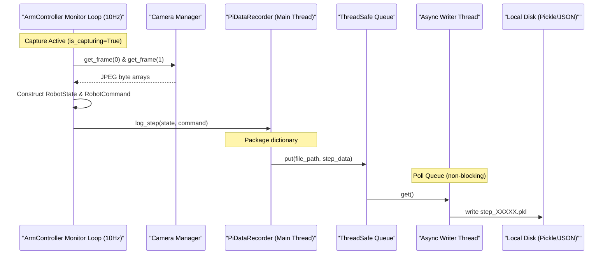

# Dataset Recording Architecture

To support machine learning and imitation learning pipelines (such as Vision-Language-Action models), the robot has a built-in dataset recorder. It captures high-fidelity telemetry, joint commands, and dual-camera video feeds at a structured sampling frequency (typically 10Hz).

---

## Recording Flow Diagram



---

## 1. Episode Initialization

Recording is toggled via the UI button or the console command `capture`. When an episode starts:
1. `ArmController.toggle_capture()` generates a unique task ID (e.g. `ep_20260706_140300`).
2. Creates an episode folder in the configured save directory (defined in `config.json`'s `recording.save_directory`, e.g., `pi_recorded_data`):
   $$\text{Folder Format: } \text{YYYYMMDD\_HHMMSS\_ep\_[counter]}$$
3. Writes a **`metadata.json`** file containing the following details:
   ```json
   {
       "source": "raspberry_pi",
       "goal_text": "flip the lever to the other side",
       "task_id": "ep_20260706_140300",
       "start_time": "20260706_140300",
       "motor_limits": {
           "A": [-225.0, 225.0],
           "B": [-250.0, 100.0],
           "C": [-315.0, 315.0]
       },
       "config_port_mapping": "saved_in_urdf"
   }
   ```
4. If a goal image exists in the trigger command, it is pickled as `goal_image.pkl` in the episode directory.

---

## 2. Complete Dataclass Schema Reference Table

The recording engine serializes data into structured dataclasses defined in `octolego-ees/shared/classes.py`:

| Dataclass | Field Name | Data Type | Units / Format | Description |
| :--- | :--- | :--- | :--- | :--- |
| **`RobotState`** | `motor_positions` | List[float] | Degrees ($[-180^\circ, 180^\circ]$) | Raw physical motor shaft encoder angles for axes A, B, and C. |
| | `camera_frames` | List[bytes] | Raw JPEG byte arrays | Compressed image payloads from Top View (Slot 0) and Wrist (Slot 1) cameras. |
| | `joint_angles` | List[float] | Degrees ($[-360^\circ, 360^\circ]$) | Kinematically scaled joint angles after dividing by gear ratios. |
| | `ee_position` | List[float] | Meters `[x, y, z]` | Cartesian tool tip position computed via Pinocchio forward kinematics. |
| | `timestamp` | Float | Seconds (Epoch) | Floating-point timestamp of state capture. |
| **`RobotCommand`**| `target_velocities`| List[float] | Fraction ($[-1.0, 1.0]$) | Commanded PWM speeds for axes C, B, and A. |
| | `target_positions` | List[List[float]]| Degrees | Target joint angle arrays. |
| | `gripper_open` | List[bool] | Boolean | Gripper actuation status (`True` if open). |
| | `halt_flag` | Boolean | Boolean | Emergency stop (`stop`) safety flag. |
| | `timestamp` | Float | Seconds (Epoch) | Floating-point timestamp of command generation. |
| **`GoalMessage`** | `text_prompt` | String | UTF-8 String | Language task instruction (e.g., `"stack the blue cube"`). |
| | `goal_image` | Optional[bytes]| Raw JPEG byte array | Visual image goal target (if provided). |
| | `task_id` | String | Unique ID | Identifier linking the prompt to the recorded episode folder. |

---

## 3. Architectural Rationale: Why Pickle over JSON?

While JSON is universal, saving step records as binary **Python Pickle (`.pkl`)** files was a deliberate architectural decision driven by embedded Raspberry Pi hardware constraints:
1. **Binary Image Preservation**: Each step contains two JPEG camera frames ranging from $30\text{KB}$ to $100\text{KB}$ each. Converting binary arrays to JSON requires base64 string encoding, increasing file size by $\sim 33\%$ and consuming significant CPU cycles at $10\text{Hz}$.
2. **Numpy & Float Serialization**: Pickle directly dumps floating-point arrays and numpy structures without string parsing overhead.
3. **SD Card I/O Performance**: Writing compact binary `.pkl` files reduces SD card write wear and disk bandwidth by over $40\%$ compared to verbose JSON formatting.

---

## 4. Asynchronous Write Pipeline & SD Card Protection

Writing files directly to disk in the monitoring thread causes write blocking, resulting in dropped frames and sample rate jitter.

To ensure deterministic 10Hz sampling:
* `PiDataRecorder` uses a **thread-safe queue (`queue.Queue`)** to hold pending write operations.
* A dedicated **daemon writer thread** (`_write_worker`) continuously pops items from the queue and saves them asynchronously.
* File naming convention: `step_00000.pkl`, `step_00001.pkl`, etc.
* **Finalization (`end_episode`)**: When recording stops, the main thread calls `write_queue.join()`. This blocks the thread just long enough to flush all remaining cached frames to disk before marking the episode completed.
* **Clean-up**: If an episode is stopped and contains `0` recorded steps, the recorder automatically deletes the empty directory to prevent clutter.

---

## 5. Playback and Remote Data Extraction

Since step pickle files contain heavy camera bytes, the FastAPI server optimizes data retrieval for the frontend playback tool:

* **Telemetry Query (`/api/dataset/{ep_id}/step/{step_id}/telemetry`)**:
  * Loads the pickle file from disk.
  * Deletes the `"camera_frames"` key from the state dictionary in memory.
  * Returns the lightweight telemetry JSON over HTTP (saving massive network bandwidth).
* **Frame Extraction (`/api/dataset/{ep_id}/step/{step_id}/image/{cam_id}`)**:
  * Loads the pickle file, extracts the selected camera byte index (`cam_id`), and returns the raw JPEG payload as a standard `image/jpeg` binary response.
