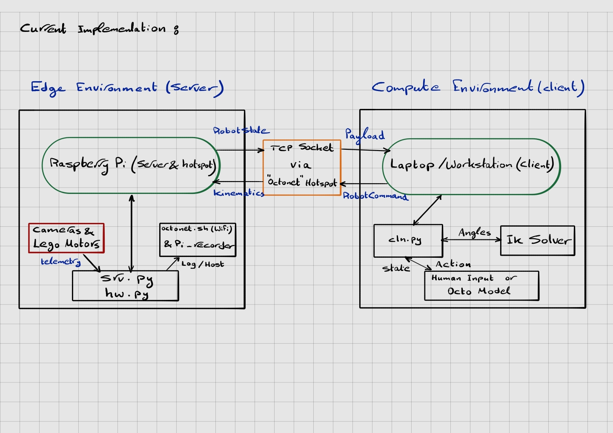
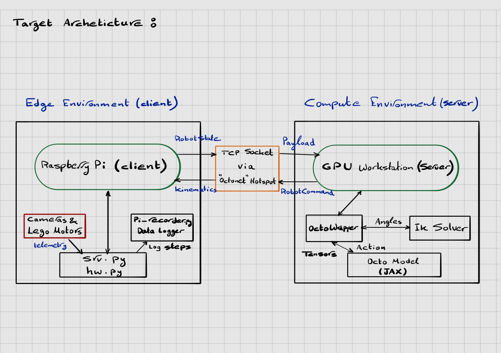
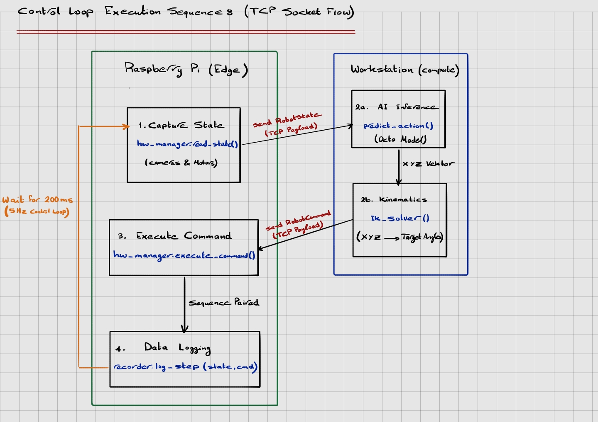

# VLA System Architecture

*For the full, printable integration summary, download the [VLA Architecture PDF](docs/VLA_Architecture.pdf).*

## 1. Current Implementation (Evaluated Setup)

The following diagram illustrates the architecture exactly as it is currently written in the provided starter code (`srv.py`, `cln.py`, and `octonet.sh`). 

In this local debugging setup, the network roles are reversed. The Raspberry Pi acts as both a standalone Wi-Fi hotspot and the network server, while the developer laptop or GPU workstation connects to it as a client.

* **Edge Environment (Server):** The Pi hosts the "octonet" network and runs the `srv.py` socket listener on port 8080.
* **Compute Environment (Client):** The developer laptop connects via `mock_ctrl.py` or `cln.py` to send manual commands or run localized tests.

---

## 2. Target Production Architecture (Proposed)

The following diagram illustrates our current target architecture for the production phase. If requirements shift, we can update this design collaboratively. 

For the final finetuning phase, the GPU Workstation is designated to act as the centralized Server.

* **Compute Environment (Server):** The GPU Workstation serves as the central hub, configured to listen for incoming network connections from the robot. This machine handles all computationally heavy tasks, including the JAX/Flax model inference and Inverse Kinematics.
* **Edge Environment (Client):** The Raspberry Pi will be configured as the network client. It will initiate an outbound TCP connection directly to the local server to transmit continuous hardware telemetry and receive computed motor commands.

---

## 3. Control Loop Execution Sequence (TCP Socket Flow)

The system enforces a continuous control loop running at 5 Hz (one cycle every 200ms). The diagram below visualizes the strict chronological sequence of operations occurring during a single execution frame. 

This clarifies the exact timing of the Inverse Kinematics calculations and the data logging within the pipeline.

### Chronological Steps:
1. **State Capture & Transmission (Pi → Workstation):** The hardware manager reads the current camera frames and motor angles, packages them into a `RobotState`, and sends the serialized byte payload across the TCP socket.
2. **Inference & Kinematics (Workstation):** The Workstation receives the state and passes it to the active policy (e.g., `OctoWrapper` or `GamepadWrapper`). 
    * *AI Inference:* The model predicts an abstract XYZ coordinate shift in Task Space.
    * *Kinematics:* **The Inverse Kinematics Solver executes on the Workstation**, translating the XYZ delta into specific motor joint angles before packaging them into a `RobotCommand`.
3. **Command Transmission (Workstation → Pi):** The calculated target angles (`RobotCommand`) are serialized and sent back across the network to the Raspberry Pi.
4. **Execution & Logging (Pi):** The Pi receives the command and actuates the Lego motors. **Only after the motor command is received and executed does the Pi trigger the data logger.** It saves both the initial `RobotState` and the resultant `RobotCommand` into a single `.pkl` step file to guarantee perfect chronological pairing for behavioral cloning.